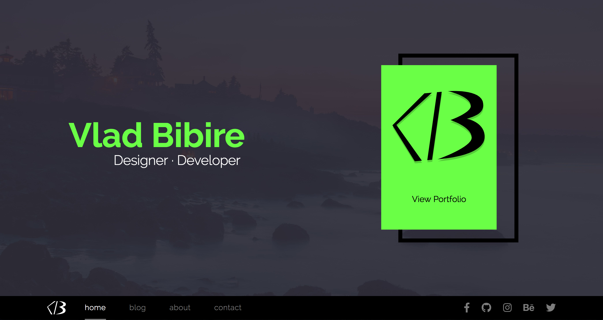

Modern Personal Website
=============================

A dynamic multipage web application which incorporates a portfolio section, blog & posts, about and contact page.
This website wis made using Jekyll, styled with Sass and scripted with Vanilla Javascript.




## System Preparation

In order to use this project, you'll need the following things installed on your machine.

1. [Jekyll](http://jekyllrb.com/) - `$ gem install jekyll`
2. [NodeJS](http://nodejs.org) - use the installer.
3. [GulpJS](https://github.com/gulpjs/gulp) - `$ npm install -g gulp` (mac users may need sudo)

## Local Installation

1. Clone this repo, or download it into a directory of your choice.
2. Inside the directory, run `npm install`.

## Usage

**development mode**

This will give you file watching, browser synchronisation, auto-rebuild, CSS injecting etc etc.

```shell
$ gulp
```

**jekyll**

As this is just a Jekyll project, you can use any of the commands listed in their [docs](http://jekyllrb.com/docs/usage/)
